# 🧩 Component Diagrams - Customer Management System

## 📋 Overview
This document provides detailed component diagrams showing the structure and relationships of all major components in the Customer Management System.

---

## 🎨 Frontend Component Hierarchy

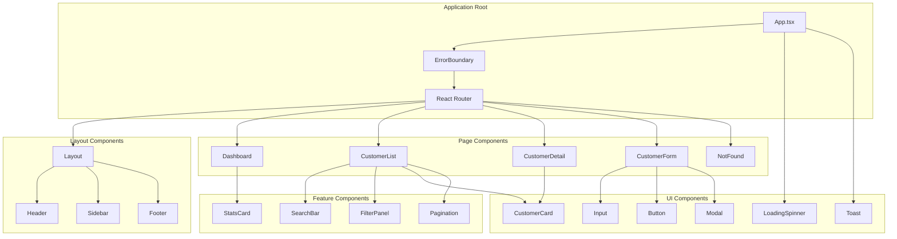

---

## 🔧 Component Details

### App Component Structure
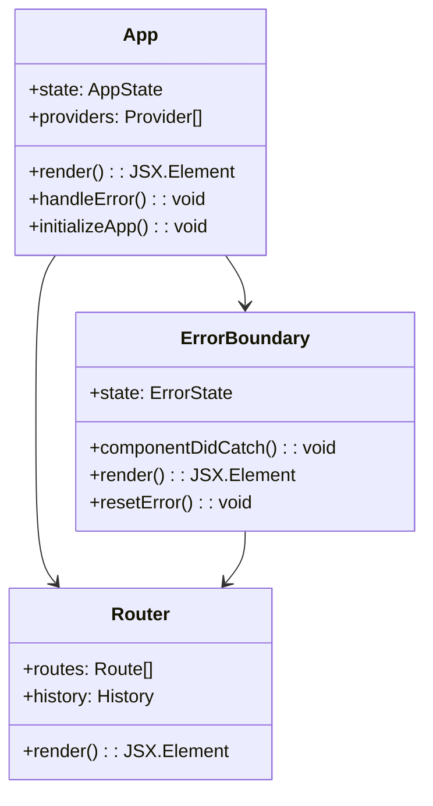

### Page Components Structure
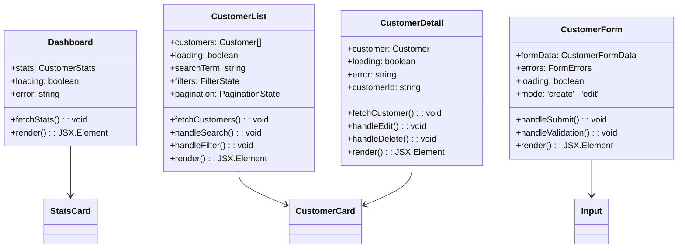

### UI Components Structure
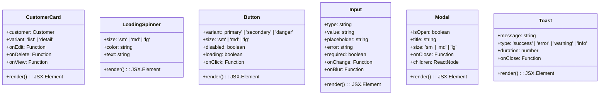

---

## 🎣 Custom Hooks Architecture

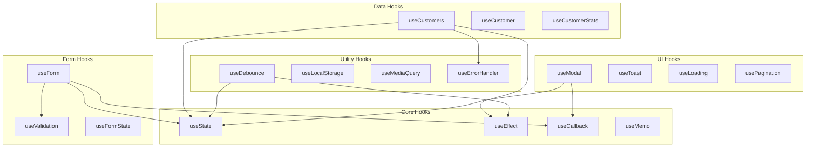

### Hook Implementation Details
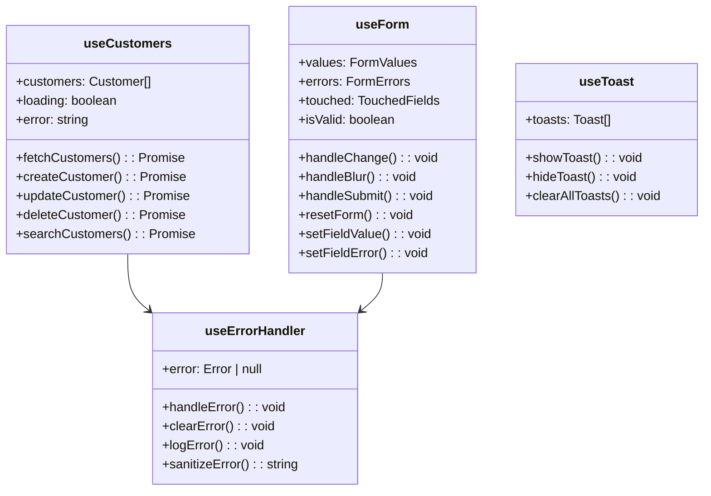

---

## 🔌 Service Layer Architecture

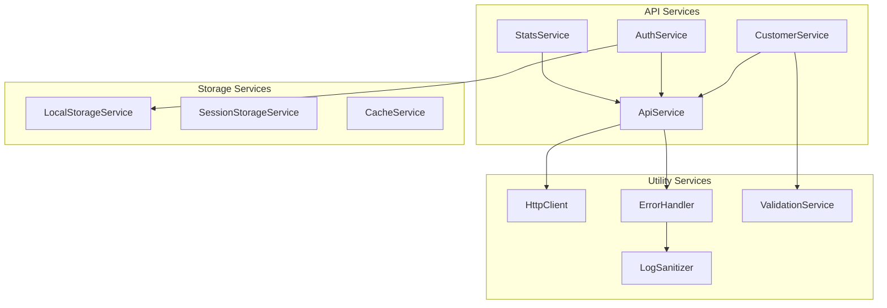

### Service Implementation Details
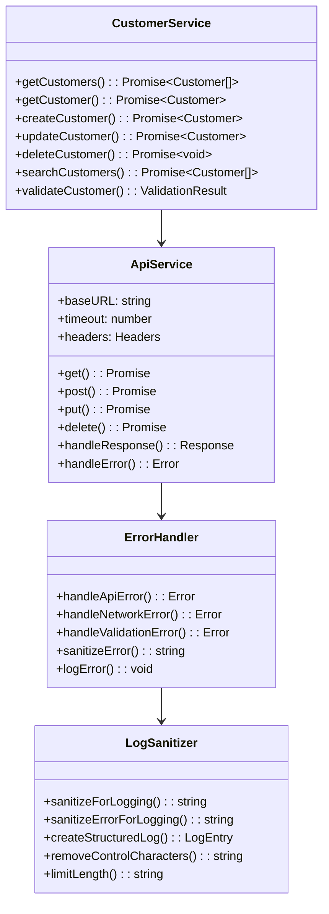

---

## 🧪 Testing Component Structure

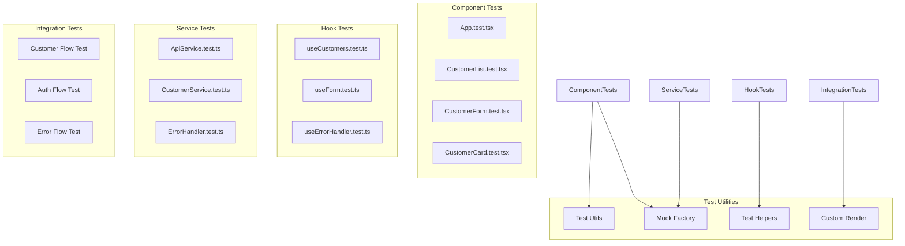

### Test Structure Details
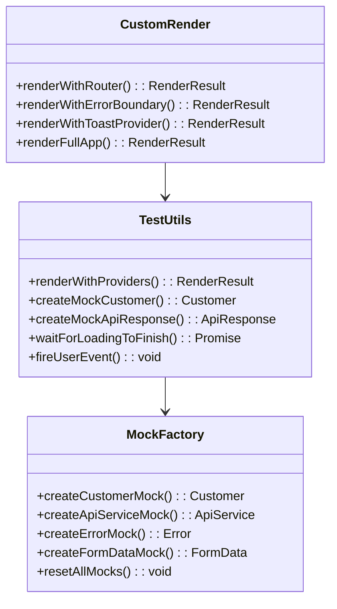

---

## 🏗️ Backend Component Architecture

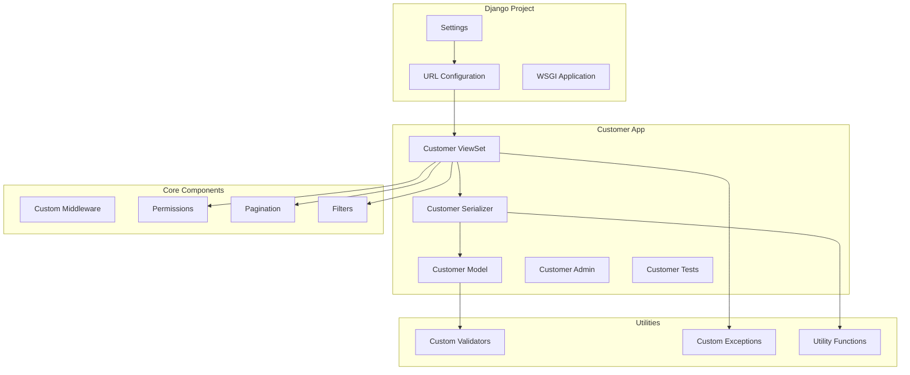

### Django Component Details
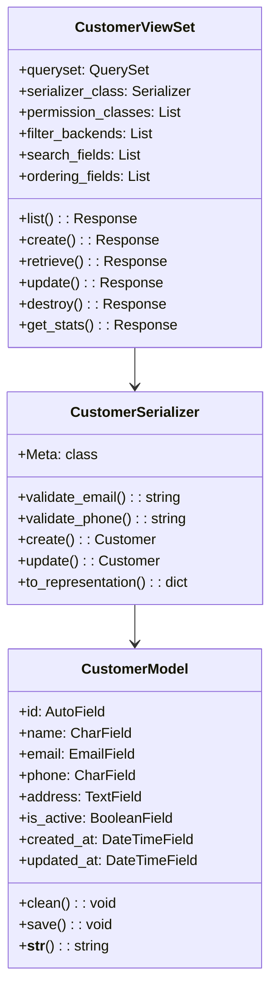

---

## 🔒 Security Component Architecture

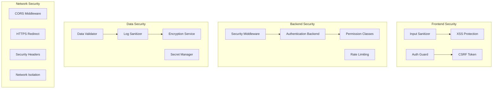

### Security Component Details
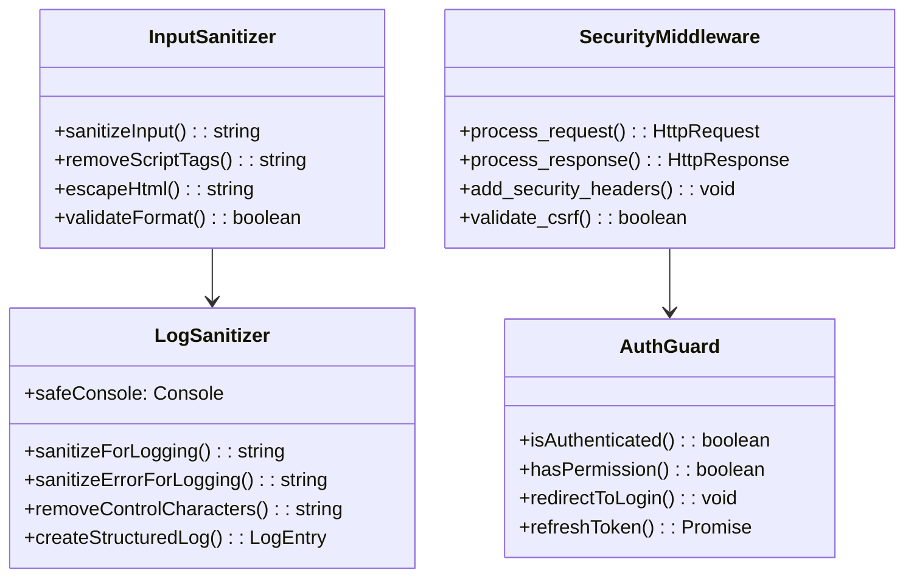

---

## 📱 Responsive Component Architecture

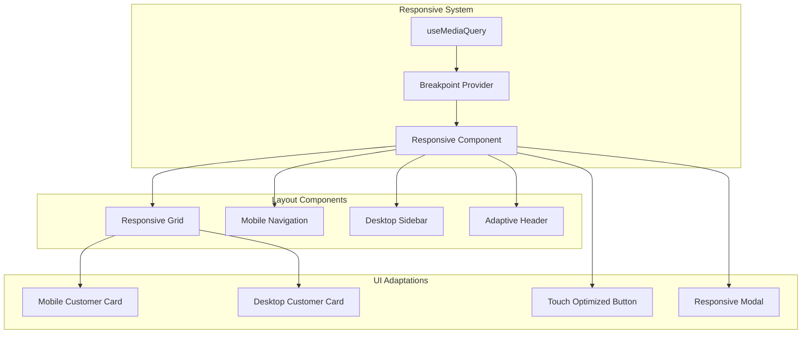

### Responsive Component Details
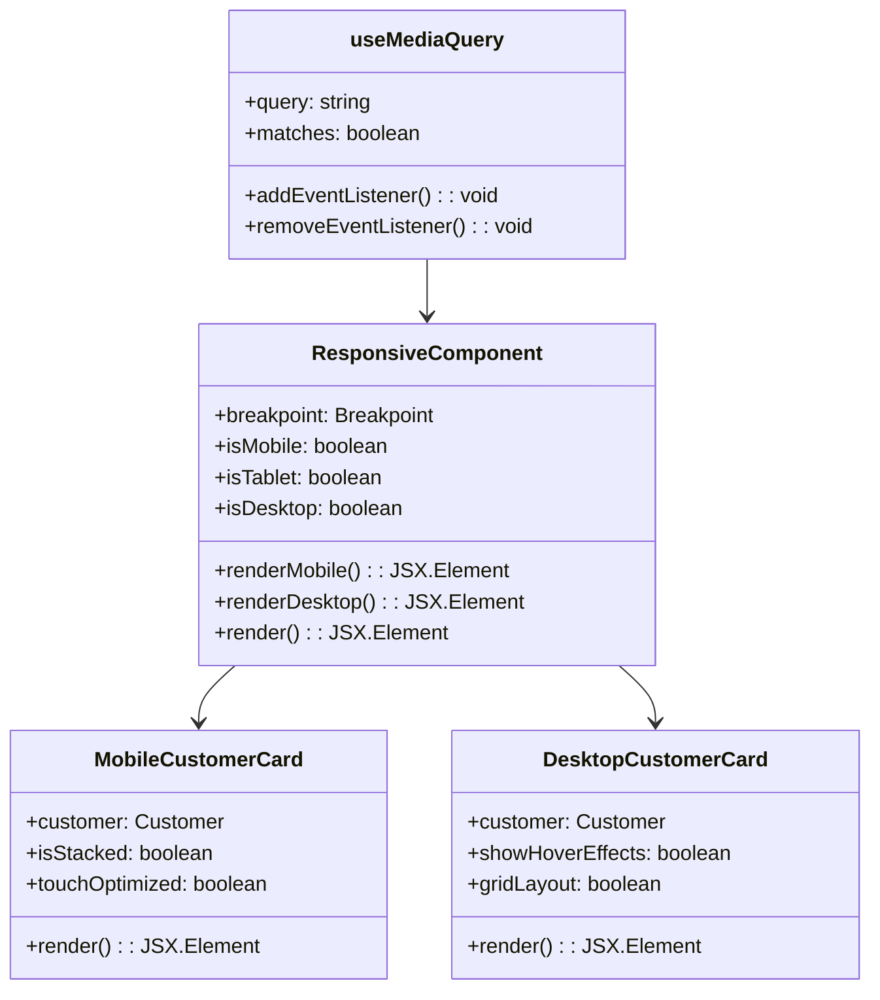

---

**Last Updated**: January 27, 2025  
**Version**: 0.2.0  
**Status**: Comprehensive Component Architecture Documentation