# 🔄 Data Flow Diagrams - Customer Management System

## 📋 Overview
This document provides detailed data flow diagrams for all major operations in the Customer Management System, showing how data moves through the system components.

---

## 🏠 Application Startup Flow

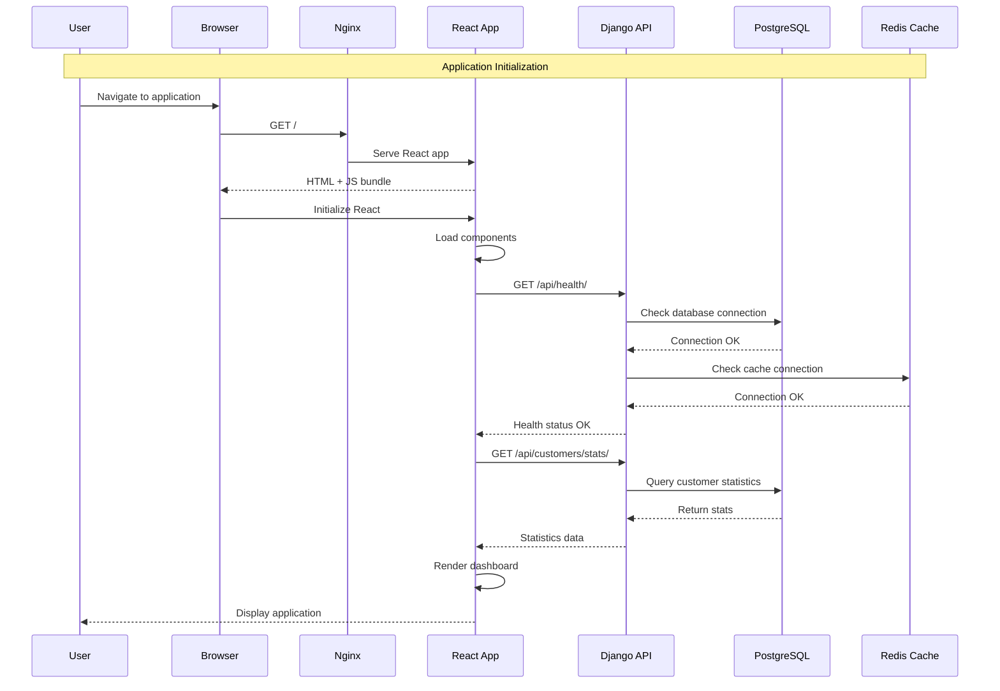

---

## 👤 Customer Management Flows

### Create Customer Flow
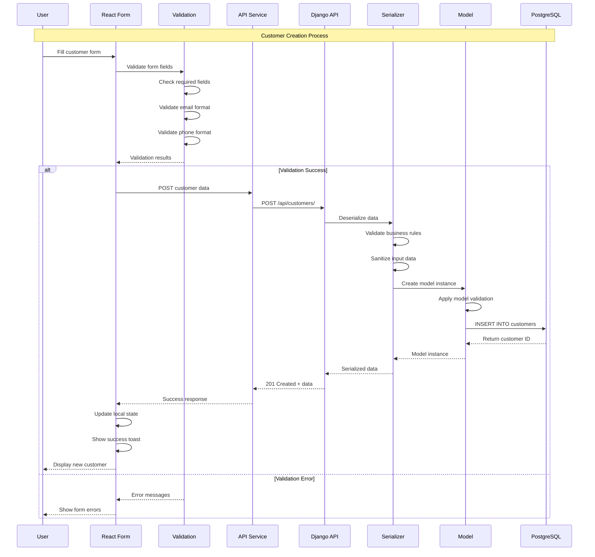

### Read Customer Flow
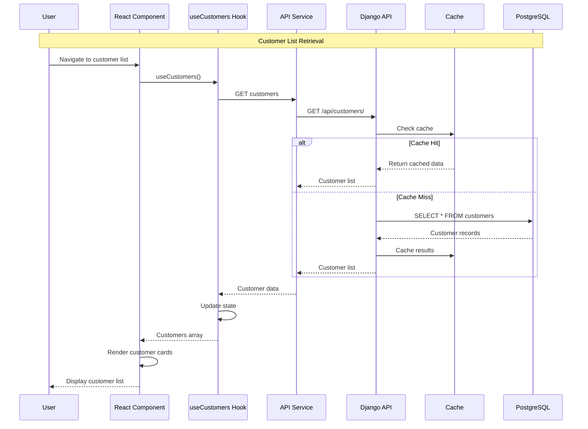

### Update Customer Flow
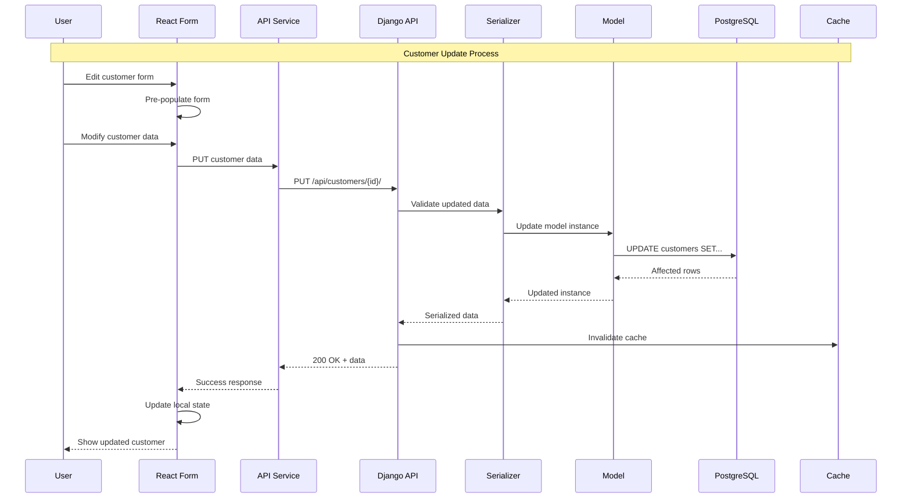

### Delete Customer Flow
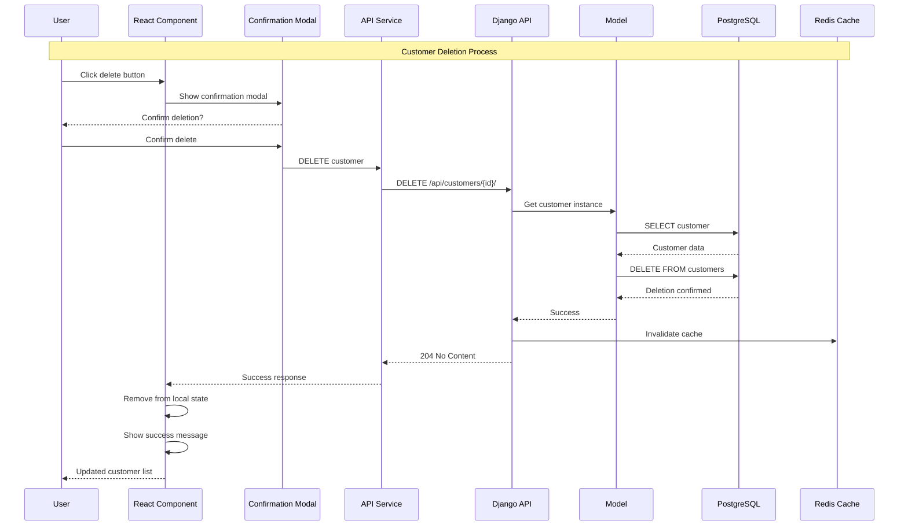

---

## 🔍 Search and Filter Flow

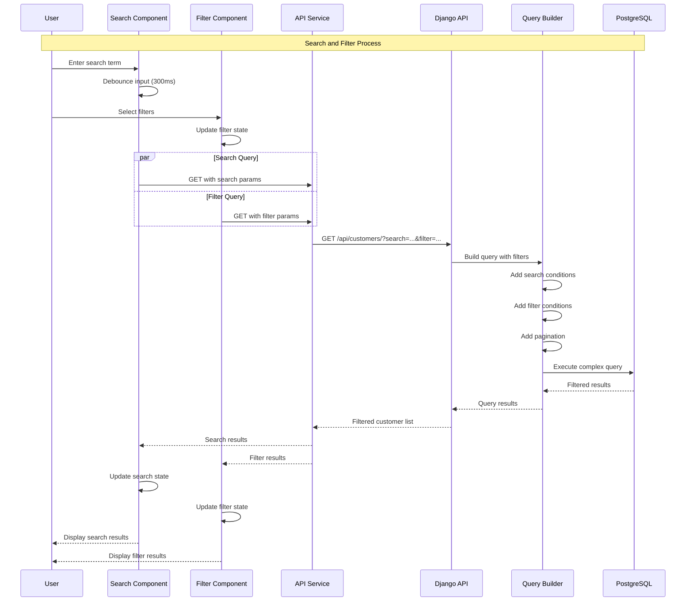

---

## 📊 Dashboard Statistics Flow

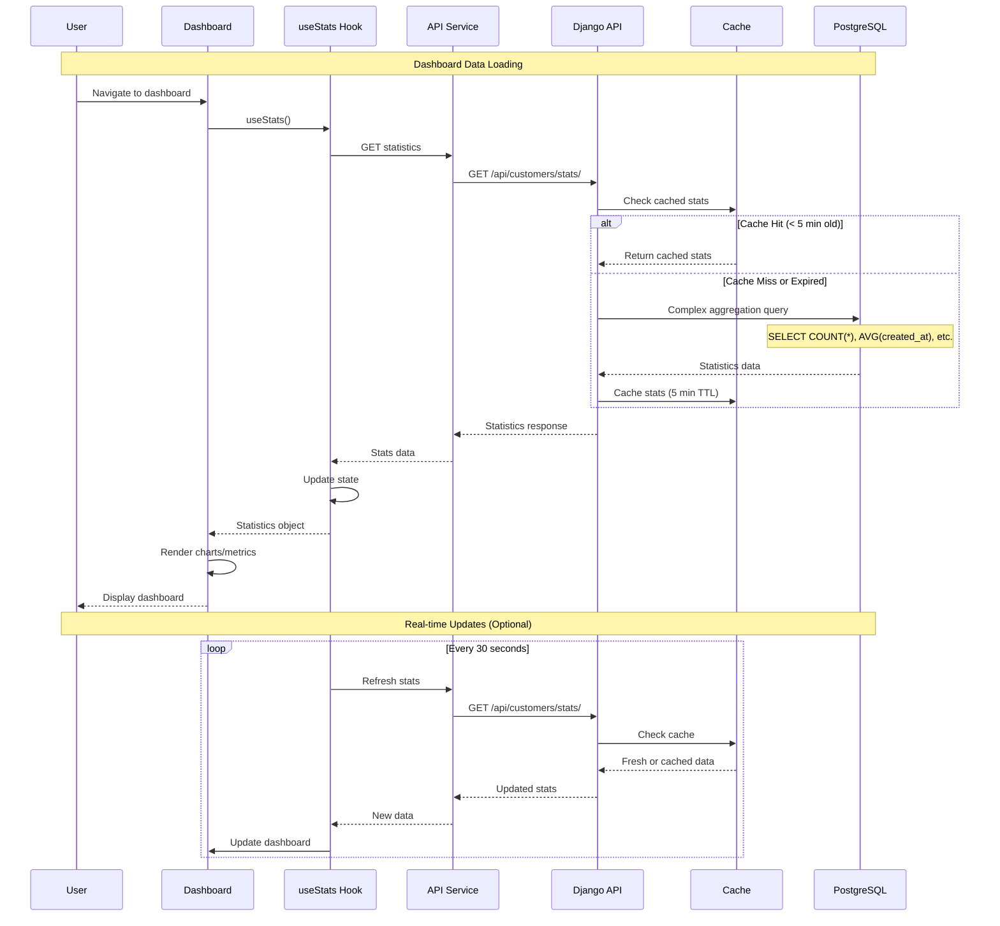

---

## 🔐 Authentication Flow

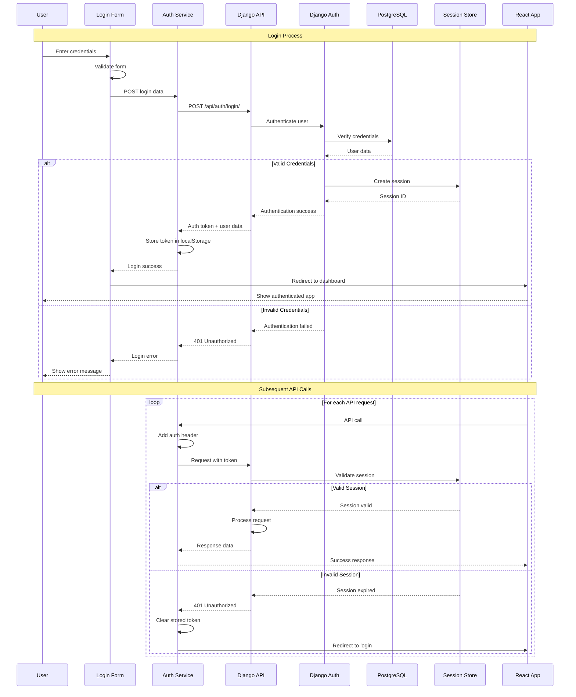

---

## ⚠️ Error Handling Flow

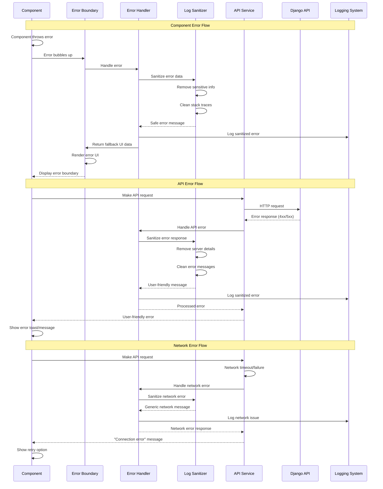

---

## 🔄 State Management Flow

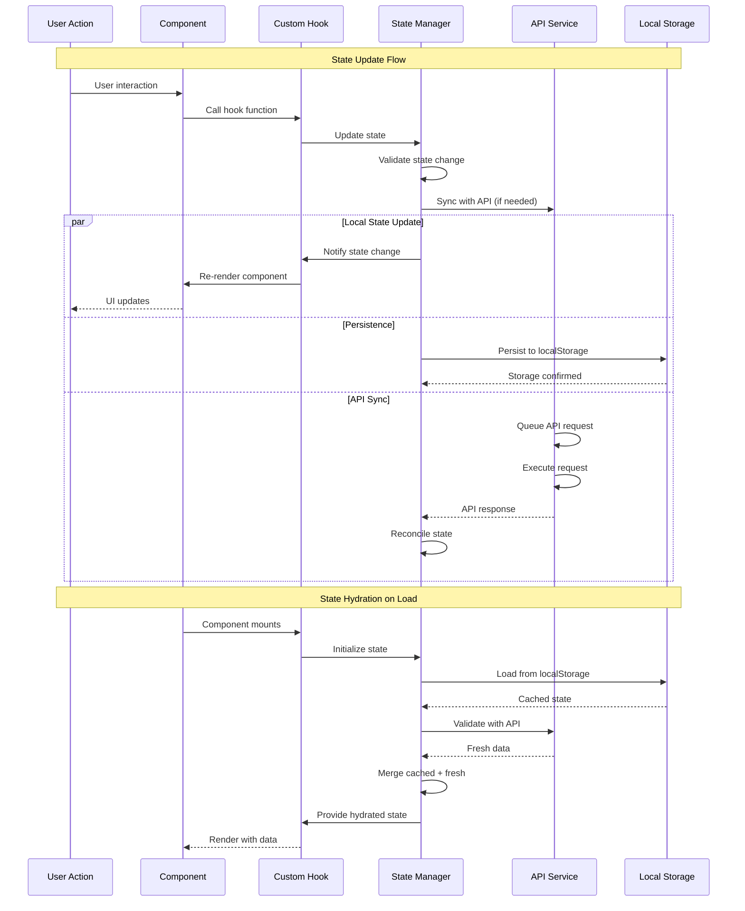

---

## 📱 Mobile Responsive Flow

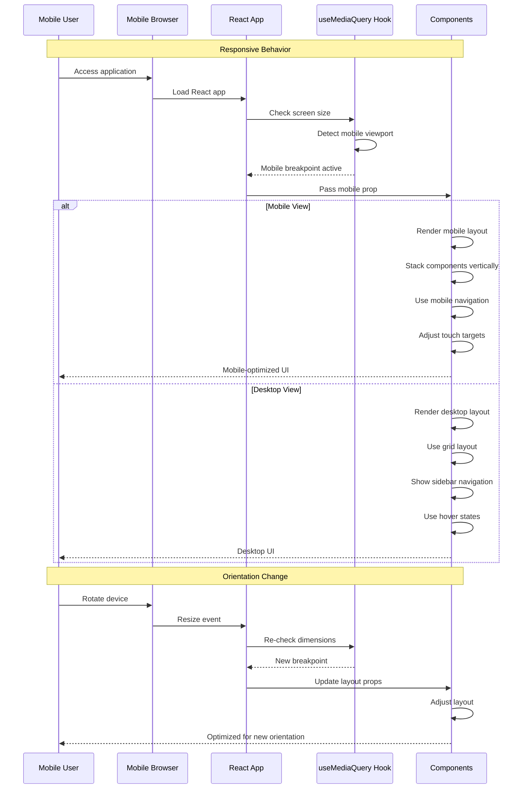

---

## 🧪 Testing Data Flow

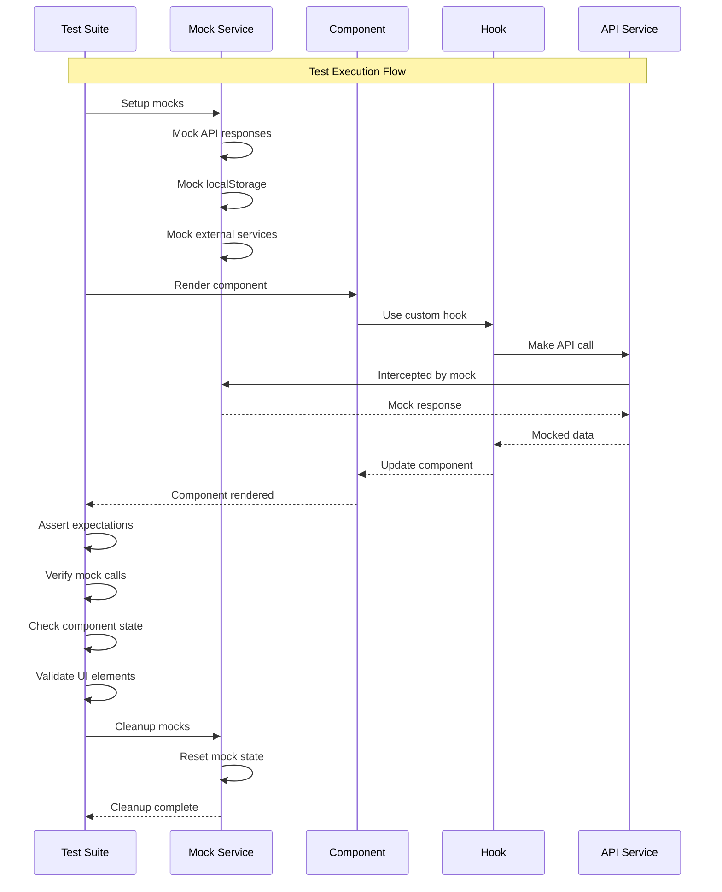

---

## 🔒 Security Data Flow

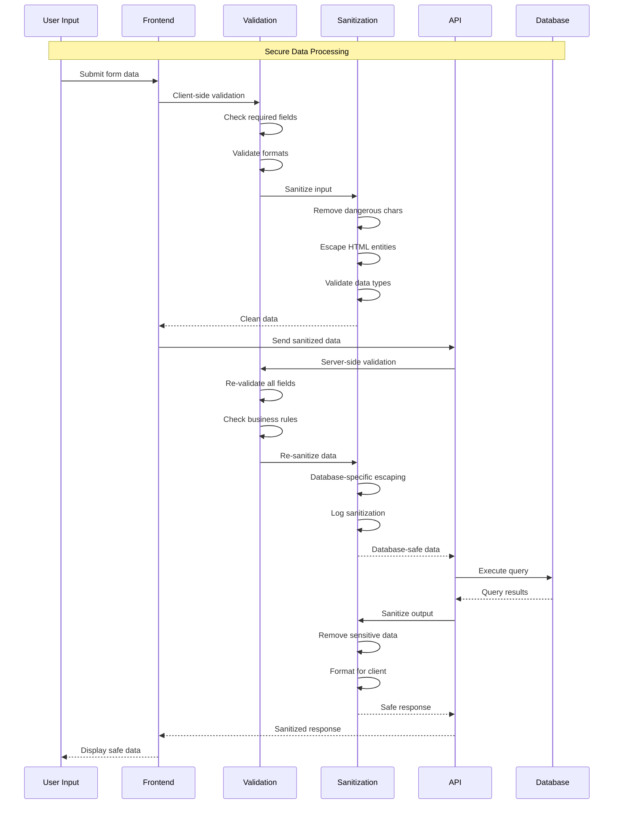

---

**Last Updated**: January 27, 2025  
**Version**: 0.2.0  
**Status**: Comprehensive Data Flow Documentation