# 🏗️ System Architecture - Customer Management System

## 📋 Overview
This document outlines the system architecture for the Django-React Customer Management System, including component relationships, data flow, and infrastructure design.

---

## 🏛️ High-Level Architecture

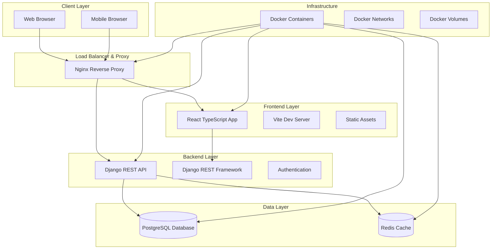

---

## 🔧 Component Architecture

### Frontend Architecture
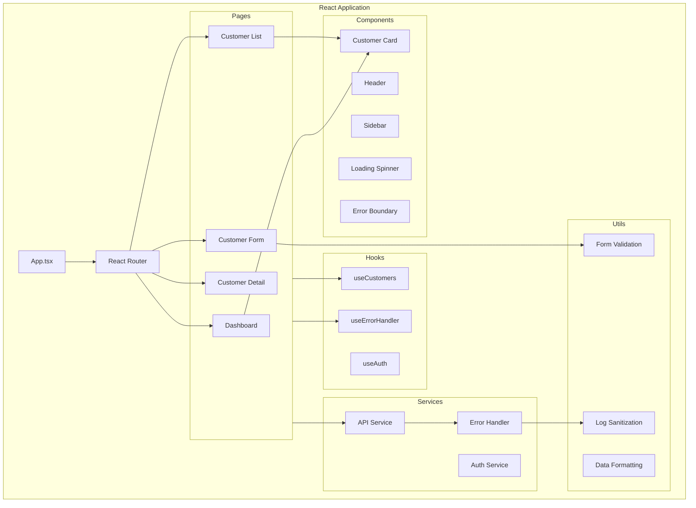

### Backend Architecture
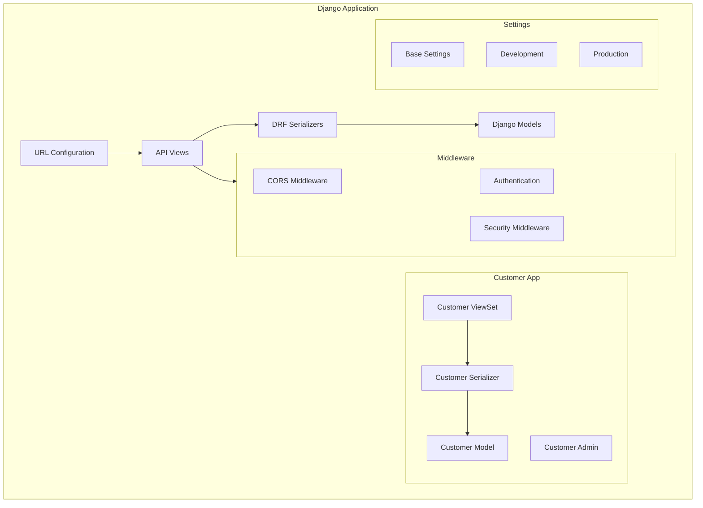

---

## 🌐 Network Architecture

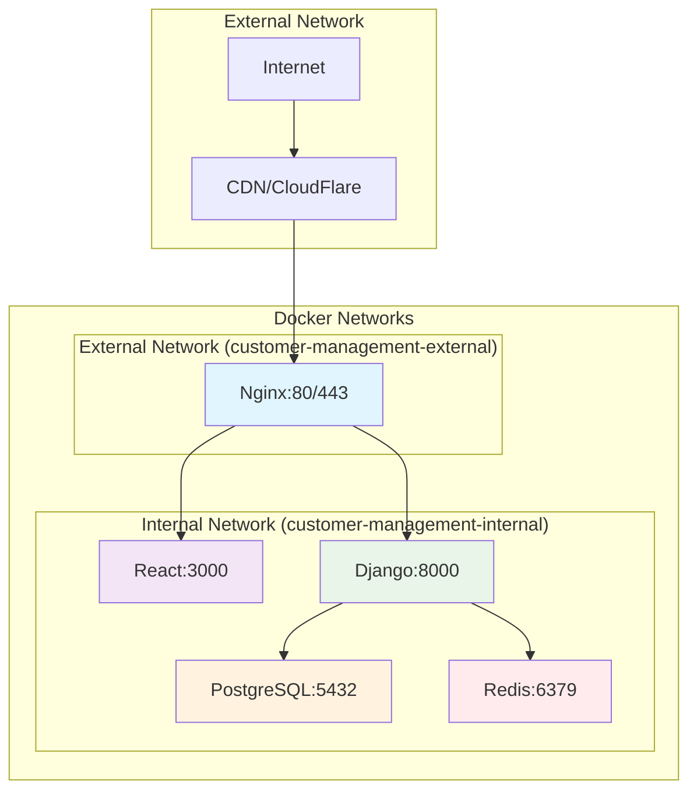

---

## 💾 Data Architecture

### Database Schema
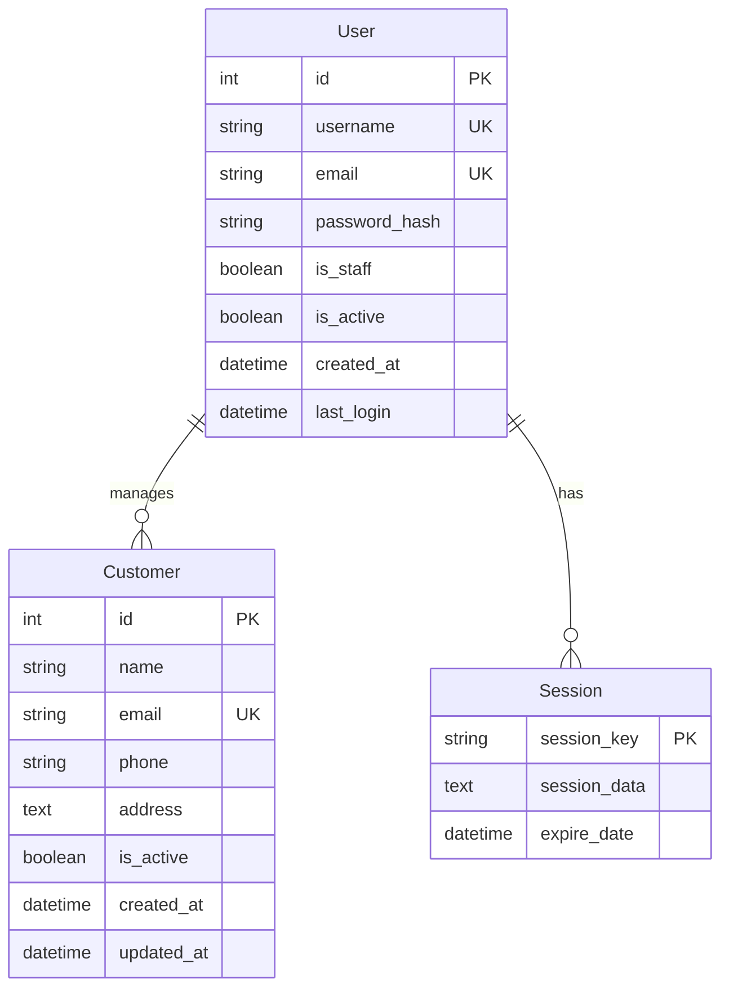

### API Data Models
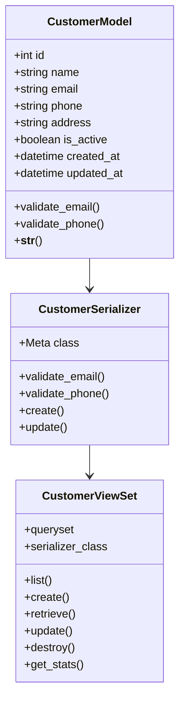

---

## 🔄 Data Flow Diagrams

### Customer CRUD Operations
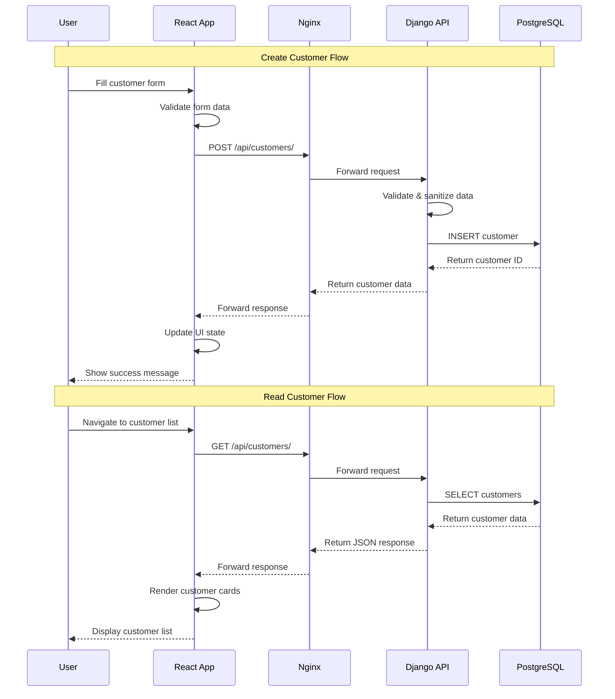

### Authentication Flow
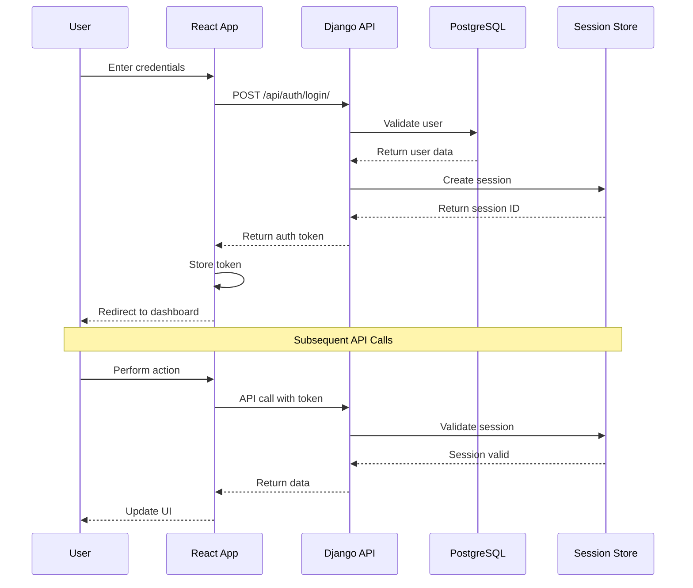

### Error Handling Flow
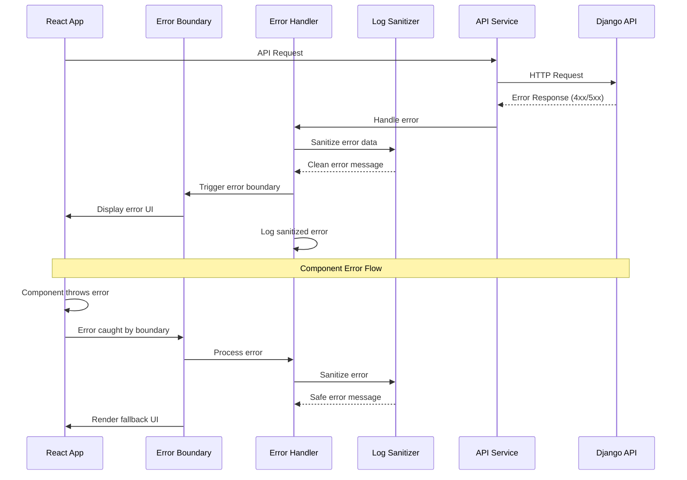

---

## 🔒 Security Architecture

### Security Layers
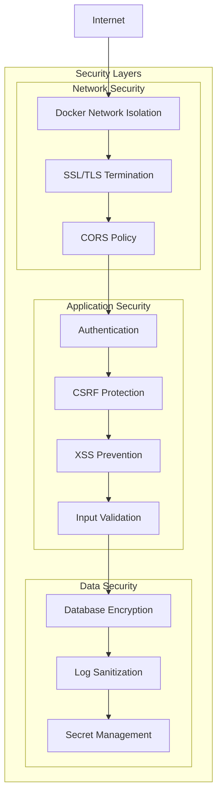

### Security Data Flow
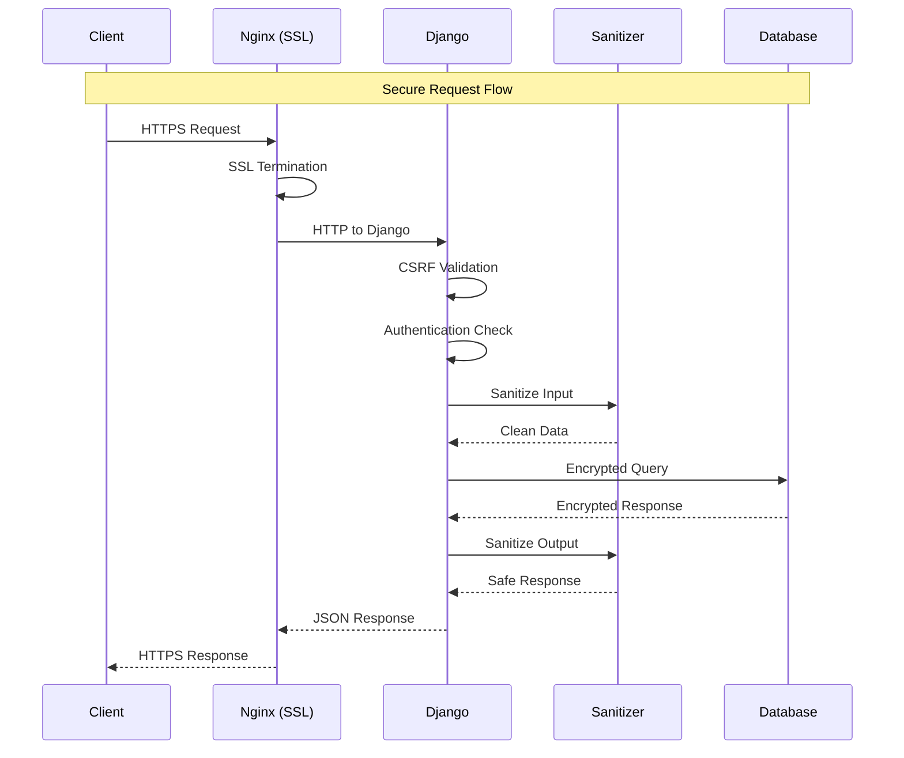

---

## 🚀 Deployment Architecture

### Container Architecture
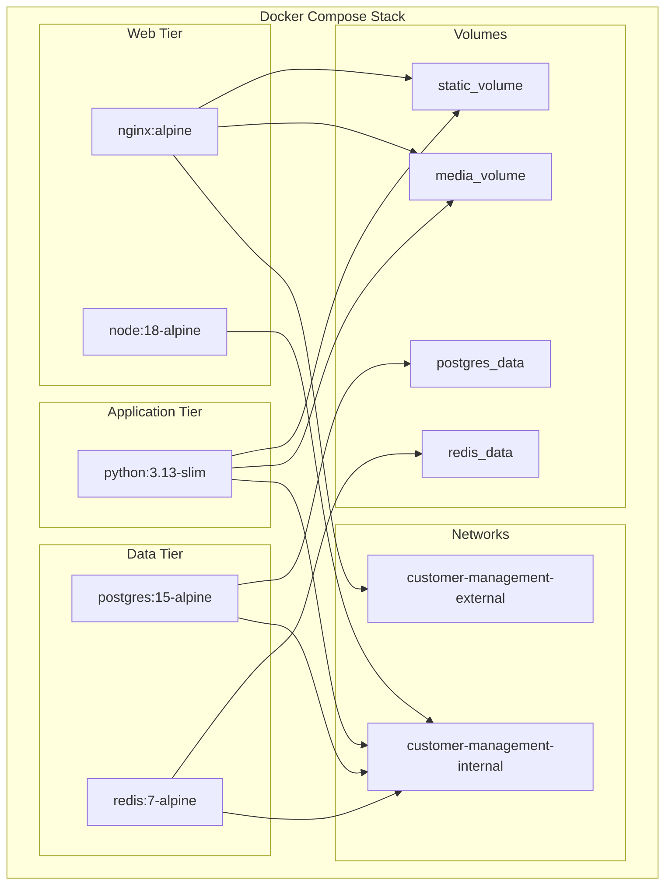

### CI/CD Pipeline Architecture
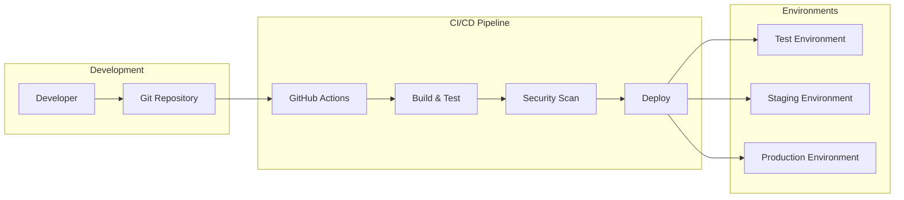

---

## 📊 Performance Architecture

### Caching Strategy
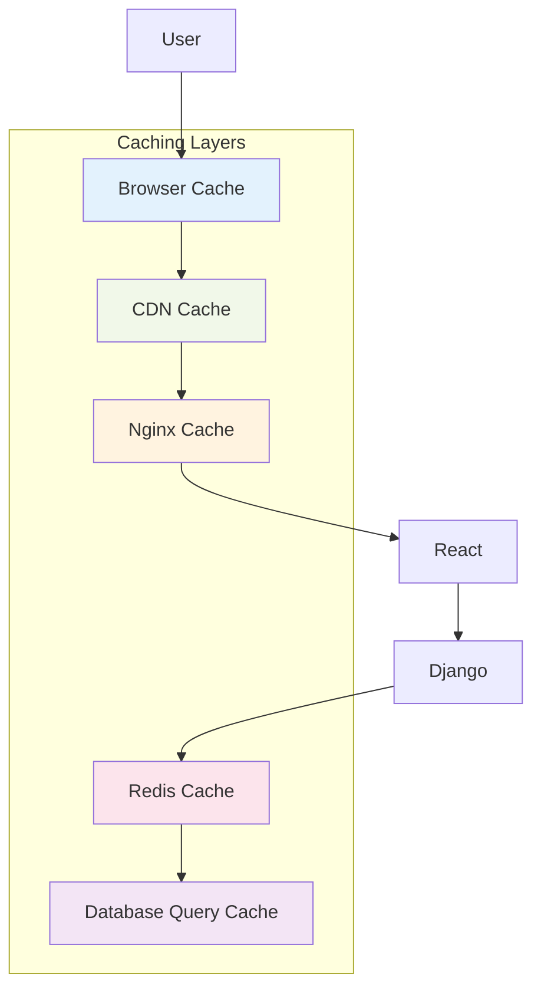

### Monitoring Architecture
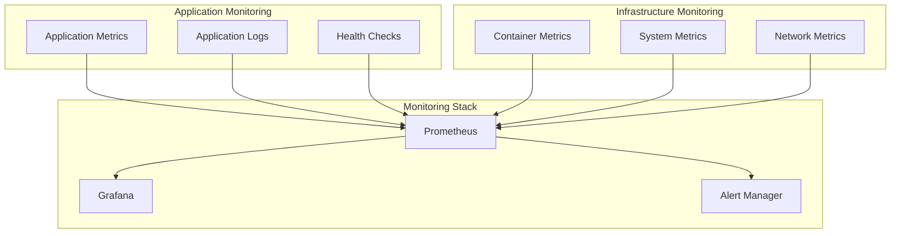

---

## 🔧 Technology Stack Summary

| Layer | Technology | Purpose |
|-------|------------|---------|
| **Frontend** | React 18 + TypeScript | User interface |
| **Build Tool** | Vite | Fast development and building |
| **Styling** | Tailwind CSS | Utility-first CSS framework |
| **Backend** | Django 4.2 + DRF | REST API and business logic |
| **Database** | PostgreSQL 15 | Primary data storage |
| **Cache** | Redis 7 | Session storage and caching |
| **Web Server** | Nginx | Reverse proxy and static files |
| **Container** | Docker + Docker Compose | Containerization |
| **Testing** | Jest + React Testing Library | Frontend testing |
| **Testing** | pytest + Django Test | Backend testing |
| **CI/CD** | GitHub Actions | Automated testing and deployment |
| **Security** | OWASP Best Practices | Security hardening |

---

**Last Updated**: January 27, 2025  
**Version**: 0.2.0  
**Status**: Production Ready Architecture